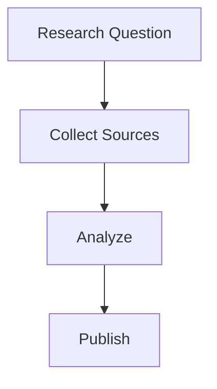
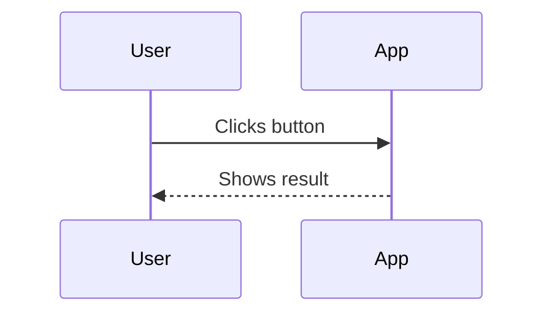
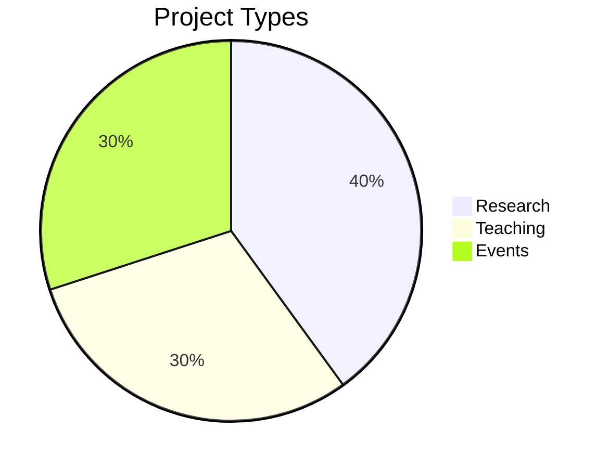

Write Mermaid diagrams using fenced blocks labeled `mermaid`.

## Notes

- Mermaid is rendered client-side from a CDN.
- If you don’t see a diagram, check your browser console for errors.

## Sequence Diagram

## Pie Chart

---

**Tip:** See the [Mermaid docs](https://mermaid-js.github.io/) for more diagram types.
